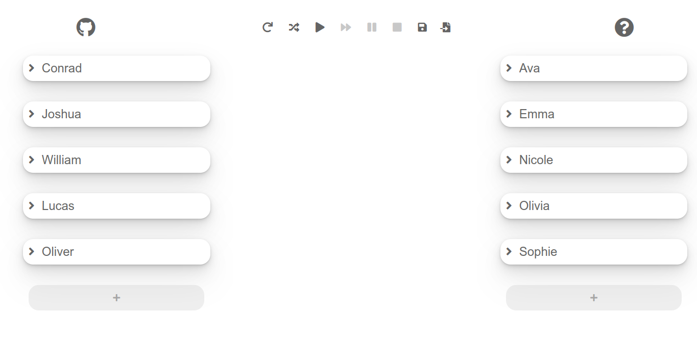

# stmviz &middot;  
A stable marriage algorithm visualizer.

## Overview
This is a visualizer for the classic [Gale-Shapley Algorithm](https://en.wikipedia.org/wiki/Gale%E2%80%93Shapley_algorithm). 
Implemented through a web-application and ES6. To support a wide array of browsers, a build system is in place which is Grunt.
One of the tasks it automatically does is transpiling all the ES6 code to ES5 with the help of Babel. The build system also minifies
the stylesheets and the final scripts.

## Screenshot

## Installation
- `npm install --dev` - to install the task runner dependencies and be able to build the scripts. 
- `npm run build` - to run Grunt and its tasks of automatically transpiling and minifying scripts.

## Development
### Frontend
Ease of use is a priority in this project as it is a visualizer. The controls have been made intuitive as possible. In this visualizer we have a set of
entities or people in either group of male or female. Each male has a list of all the females arranged top to bottom starting with whom they prefer the most.
The females also have a list of all the males arranged top to bottom also starting with whom they prefer the most. Here are the features included in the frontend:
#### Changing an entity's name
Whenever the user changes any person's name, then that name is updated in real-time including on everybody else's list. 

#### Arranging an entity's preference list
The user can also rearrange any entity's preference list by simply drag-and-dropping the names on the list.

#### Removing an entity
A trash icon appears on any entity the user is currently hovering at. Removing that entity will also automatically remove 
all its occurence in everybody else's list.

#### Adding an entity
When an entity is added, that entity is automatically inserted on the list of the opposite group.

#### Randomizing all the entities and their preference
The entities can be randomized by clicking the randomize icon.

#### Reset to default
There is a default configuration when the visualizer starts, one can revert back to that with 
the reset to default.

#### Saving configuration
The user may download the configuration the visualizer currently has.

#### Loading configuration
The user may load the configuration that they saved from the visualizer and is stored at their device.

#### Playing the algorithm visualization
The application seamlessly starts the animation on demand and the user can watch in ease, as the containers automatically
adjust to accomodate for the entities that need to be shown.

#### Pausing the algorithm visualization
The user may pause at any time the visualization is running.

#### Skipping the algorithm visualization
There is also an option to simply skip all the visualization and get to the results right away.

#### Interacting with the results
When the visualization is finished, the results can be interacted with. The user can check the pairs simply
by clicking on any entity.

#### Stopping the visualization
The user may stop the visualization at any time and it will go back to their latest configuration.
